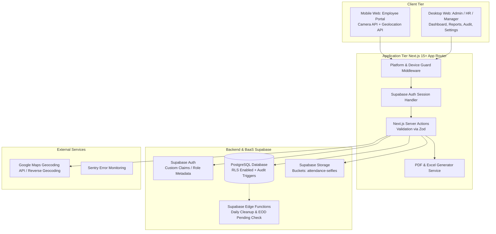
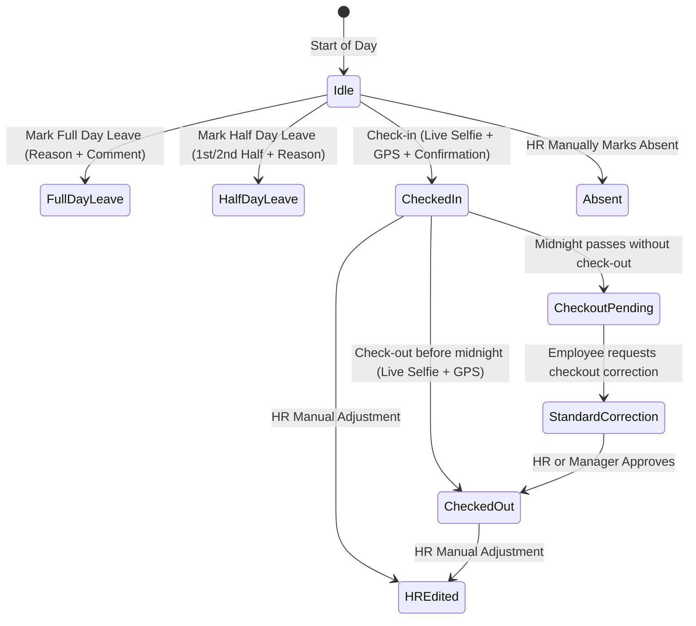

# System Requirements & Architecture Specification
## Staff Attendance Web Application (V1)

**Document Version:** 1.0.0  
**Stack:** Next.js (App Router) + TypeScript + Tailwind CSS + shadcn/ui + Supabase (PostgreSQL, Auth, Storage, Edge Functions) + Zod  
**Target Environments:** Mobile Web (Employee) | Desktop Web (Manager, HR, Admin)

---

## 1. System Architecture Overview



---

## 2. Role-Based Access Control & Permission Matrix

| Feature / Action | Employee (Mobile Only) | Manager (Desktop Only) | HR (Desktop Only) | Admin (Desktop Only) |
|---|:---:|:---:|:---:|:---:|
| **Platform Access** | Mobile Web | Desktop Web | Desktop Web | Desktop Web |
| **Mark Check-in / Check-out** | ✅ (Live Selfie + GPS) | ❌ | ❌ | ❌ |
| **Mark Today's Leave (Full/Half)** | ✅ | ❌ | ❌ | ❌ |
| **View Own Attendance History** | ✅ (Summary only) | ❌ | ❌ | ❌ |
| **Submit Attendance Correction** | ✅ (Own records only) | ❌ | ❌ | ❌ |
| **Create/Edit Daily Work Report** | ✅ (Current day only) | ❌ | ❌ | ❌ |
| **View All Attendance & Work Reports**| ❌ | ✅ | ✅ | ✅ |
| **View Selfie & GPS Evidence** | ❌ | ✅ | ✅ | ✅ |
| **Approve Forgotten Check-out** | ❌ | ✅ | ✅ | ❌ |
| **Approve Normal Corrections** | ❌ | ❌ | ✅ | ❌ |
| **Direct Attendance Adjustment** | ❌ | ❌ | ✅ (With reason) | ❌ |
| **Manually Mark Absent** | ❌ | ❌ | ✅ (With reason) | ❌ |
| **Configure Timing & Reminder Rules**| ❌ | ❌ | ✅ | ❌ |
| **Manage Employee Accounts** | ❌ | ❌ | ✅ | ✅ |
| **Reset Employee Credentials** | ❌ | ❌ | ✅ | ✅ |
| **Manage Dept / Designation Masters**| ❌ | ❌ | ❌ | ✅ |
| **Manage User Roles** | ❌ | ❌ | ❌ | ✅ |
| **View Full Audit Log** | ❌ | ❌ (Scoped only) | ✅ | ✅ |
| **Export Excel & PDF Reports** | ❌ | ✅ (Filtered) | ✅ (Filtered) | ✅ (Filtered) |
| **Permanent Record Deletion** | ❌ | ❌ | ✅ (Audited) | ✅ (Audited) |

---

## 3. Database Schema (PostgreSQL DDL Specification)

### 3.1 Enumerations
```sql
CREATE TYPE user_role AS ENUM ('employee', 'manager', 'hr', 'admin');

CREATE TYPE attendance_status AS ENUM (
    'present',
    'late',
    'half_day_attendance',
    'half_day_leave',
    'leave',
    'absent',
    'checked_in',
    'checked_out',
    'checkout_pending'
);

CREATE TYPE leave_half_type AS ENUM ('first_half', 'second_half');

CREATE TYPE correction_status AS ENUM ('pending', 'approved', 'rejected');

CREATE TYPE correction_type AS ENUM ('checkin_time', 'checkout_time', 'status', 'forgotten_checkout');
```

### 3.2 Tables

```sql
-- 1. Departments Master (Admin-only managed)
CREATE TABLE departments (
    id UUID PRIMARY KEY DEFAULT gen_random_uuid(),
    name VARCHAR(100) NOT NULL UNIQUE,
    code VARCHAR(20) NOT NULL UNIQUE,
    is_active BOOLEAN NOT NULL DEFAULT true,
    created_at TIMESTAMPTZ NOT NULL DEFAULT now(),
    updated_at TIMESTAMPTZ NOT NULL DEFAULT now()
);

-- 2. Designations Master (Admin-only managed)
CREATE TABLE designations (
    id UUID PRIMARY KEY DEFAULT gen_random_uuid(),
    title VARCHAR(100) NOT NULL UNIQUE,
    is_active BOOLEAN NOT NULL DEFAULT true,
    created_at TIMESTAMPTZ NOT NULL DEFAULT now(),
    updated_at TIMESTAMPTZ NOT NULL DEFAULT now()
);

-- 3. Profiles (Linked to Supabase auth.users)
CREATE TABLE profiles (
    id UUID PRIMARY KEY REFERENCES auth.users(id) ON DELETE CASCADE,
    employee_id VARCHAR(50) NOT NULL UNIQUE,
    full_name VARCHAR(150) NOT NULL,
    department_id UUID NOT NULL REFERENCES departments(id),
    designation_id UUID NOT NULL REFERENCES designations(id),
    role user_role NOT NULL DEFAULT 'employee',
    is_active BOOLEAN NOT NULL DEFAULT true,
    created_at TIMESTAMPTZ NOT NULL DEFAULT now(),
    updated_at TIMESTAMPTZ NOT NULL DEFAULT now()
);

-- 4. Attendance Rules Configuration (Singleton managed by HR)
CREATE TABLE attendance_settings (
    id INTEGER PRIMARY KEY DEFAULT 1 CHECK (id = 1),
    official_checkin_time TIME NOT NULL DEFAULT '09:00:00',
    late_threshold_minutes INTEGER NOT NULL DEFAULT 15,
    checkout_reminder_time TIME NOT NULL DEFAULT '19:00:00',
    checkout_reminder_enabled BOOLEAN NOT NULL DEFAULT true,
    notify_employee_on_hr_adjustment BOOLEAN NOT NULL DEFAULT true,
    updated_by UUID REFERENCES profiles(id),
    updated_at TIMESTAMPTZ NOT NULL DEFAULT now()
);

-- 5. Daily Attendance Records
CREATE TABLE attendance_records (
    id UUID PRIMARY KEY DEFAULT gen_random_uuid(),
    profile_id UUID NOT NULL REFERENCES profiles(id) ON DELETE CASCADE,
    attendance_date DATE NOT NULL,
    
    -- Status & Flags
    status attendance_status NOT NULL DEFAULT 'checked_in',
    is_late BOOLEAN NOT NULL DEFAULT false,
    is_hr_adjusted BOOLEAN NOT NULL DEFAULT false,
    hr_adjustment_reason TEXT,
    adjusted_by UUID REFERENCES profiles(id),
    adjusted_at TIMESTAMPTZ,

    -- Working Duration (calculated upon check-out or effective adjustment)
    working_duration_minutes INTEGER,

    -- Check-in Evidence (Immutable after capture)
    checkin_time TIMESTAMPTZ,
    effective_checkin_time TIMESTAMPTZ,
    checkin_selfie_url TEXT,
    checkin_latitude NUMERIC(10, 7),
    checkin_longitude NUMERIC(10, 7),
    checkin_location_name TEXT,

    -- Check-out Evidence (Immutable after capture)
    checkout_time TIMESTAMPTZ,
    effective_checkout_time TIMESTAMPTZ,
    checkout_selfie_url TEXT,
    checkout_latitude NUMERIC(10, 7),
    checkout_longitude NUMERIC(10, 7),
    checkout_location_name TEXT,

    -- Leave attributes if marked directly
    leave_type leave_half_type, -- NULL if full day leave or normal attendance
    leave_reason TEXT,
    leave_comment TEXT,

    created_at TIMESTAMPTZ NOT NULL DEFAULT now(),
    updated_at TIMESTAMPTZ NOT NULL DEFAULT now(),

    CONSTRAINT unique_employee_date UNIQUE(profile_id, attendance_date)
);

-- 6. Attendance Correction Requests
CREATE TABLE attendance_corrections (
    id UUID PRIMARY KEY DEFAULT gen_random_uuid(),
    attendance_id UUID NOT NULL REFERENCES attendance_records(id) ON DELETE CASCADE,
    profile_id UUID NOT NULL REFERENCES profiles(id) ON DELETE CASCADE,
    correction_type correction_type NOT NULL,
    
    -- Original Values Snapshot
    original_checkin_time TIMESTAMPTZ,
    original_checkout_time TIMESTAMPTZ,
    original_status attendance_status,

    -- Requested Values
    requested_checkin_time TIMESTAMPTZ,
    requested_checkout_time TIMESTAMPTZ,
    requested_status attendance_status,
    reason TEXT NOT NULL,

    -- Decision Workflow
    status correction_status NOT NULL DEFAULT 'pending',
    reviewed_by UUID REFERENCES profiles(id),
    reviewed_at TIMESTAMPTZ,
    review_remarks TEXT,

    created_at TIMESTAMPTZ NOT NULL DEFAULT now()
);

-- 7. Daily Work Reports (Optional, current calendar day editable)
CREATE TABLE daily_work_reports (
    id UUID PRIMARY KEY DEFAULT gen_random_uuid(),
    profile_id UUID NOT NULL REFERENCES profiles(id) ON DELETE CASCADE,
    report_date DATE NOT NULL,
    report_text TEXT NOT NULL,
    created_at TIMESTAMPTZ NOT NULL DEFAULT now(),
    updated_at TIMESTAMPTZ NOT NULL DEFAULT now(),

    CONSTRAINT unique_employee_work_report UNIQUE(profile_id, report_date)
);

-- 8. In-App Notifications
CREATE TABLE in_app_notifications (
    id UUID PRIMARY KEY DEFAULT gen_random_uuid(),
    recipient_id UUID NOT NULL REFERENCES profiles(id) ON DELETE CASCADE,
    title VARCHAR(150) NOT NULL,
    message TEXT NOT NULL,
    notification_type VARCHAR(50) NOT NULL, -- 'attendance_success', 'checkout_reminder', 'hr_adjustment', 'correction_status'
    is_read BOOLEAN NOT NULL DEFAULT false,
    created_at TIMESTAMPTZ NOT NULL DEFAULT now()
);

-- 9. Comprehensive System Audit Logs
CREATE TABLE audit_logs (
    id UUID PRIMARY KEY DEFAULT gen_random_uuid(),
    entity_name VARCHAR(50) NOT NULL, -- 'attendance', 'profile', 'role', 'master_data', 'credential'
    entity_id VARCHAR(100) NOT NULL,
    action VARCHAR(50) NOT NULL,       -- 'create', 'update', 'delete', 'approve', 'reject', 'reset_password'
    performed_by UUID NOT NULL REFERENCES profiles(id),
    previous_state JSONB,
    new_state JSONB,
    reason TEXT,
    ip_address VARCHAR(45),
    user_agent TEXT,
    created_at TIMESTAMPTZ NOT NULL DEFAULT now()
);
```

---

## 4. Key Business Logic & State Machines

### 4.1 Daily Attendance State Transition


### 4.2 Late Determination Algorithm
$$\text{Late Cutoff} = \text{Official Check-in Time} + \text{Late Threshold Minutes}$$
- Example: $09:00 + 15\text{ min} = 09:15$.
- Check-in at $09:15:00$ $\rightarrow$ On-time (`is_late = false`, `status = 'present'`).
- Check-in at $09:15:01$ $\rightarrow$ Late (`is_late = true`, `status = 'late'`).
- HR cannot manually override the `is_late` calculation flag directly; if effective check-in time is adjusted by HR or approved correction, `is_late` recalculates against the rule.

---

## 5. Security & Device Separation Rules

1. **Client Guard**:
   - Next.js middleware inspects `User-Agent`.
   - If an employee tries to access `/attendance/checkin` on a desktop viewport/browser, display a responsive notice: *"Employee attendance is restricted to mobile web devices with camera and GPS hardware."*
   - If a manager/HR tries to access management tools on mobile, render a desktop recommendation notice.
2. **Camera & GPS Security**:
   - Pure live capture via `navigator.mediaDevices.getUserMedia({ video: { facingMode: 'user' } })`.
   - File input `<input type="file">` is strictly omitted to prevent gallery uploads.
   - GPS coordinates fetched via `navigator.geolocation.getCurrentPosition({ enableHighAccuracy: true })`.
   - Reverse geocoded server-side or via Google Maps API client with raw coordinates securely recorded.
3. **Data Protection & Privacy**:
   - Original selfie images are stored in a private Supabase Storage bucket (`attendance-selfies`).
   - Image access is mediated via Signed URLs generated only for authorized roles (Manager, HR, Admin).
   - Employee role API queries are filtered out from receiving raw GPS lat/long and selfie URLs of others or even their own detailed evidence views.
   - Passwords are encrypted by Supabase Auth; audit records log credential reset events without exposing passwords.

---

## 6. Implementation Phasing

1. **Phase 1: Project Scaffolding & Design System**: Next.js App Router, Tailwind CSS, shadcn/ui components, icons (Lucide), responsive shell (Mobile frame simulator for testing + Desktop layout).
2. **Phase 2: Database & Backend Services**: Supabase client, migrations DDL, seed data (Departments, Designations, Admin, HR, Manager, Employees), Zod validation schemas.
3. **Phase 3: Employee Mobile Flow**: Live selfie capture with HTML5 canvas & MediaDevices, GPS capture & reverse geocoding, confirmation modal, check-in, check-out, working duration timer, Daily Work Report editor, current-day leave modal.
4. **Phase 4: Manager/HR/Admin Desktop Portal**: KPI Cards, Today's Attendance Real-Time Board, Evidence Drawer (Selfie preview, map coordinates, timestamps), Attendance Trends Charts, Filters & Search.
5. **Phase 5: Approvals, Corrections & HR Adjustments**: Correction submission, HR approval workflow, Manager/HR forgotten checkout approval, HR direct adjustment dialog with mandatory reason, in-app notification center.
6. **Phase 6: Reporting, Masters & Audit**: Admin Department/Designation master management, Employee profile & credential management, Excel (.xlsx) & PDF exports, System Audit Trail viewer.
